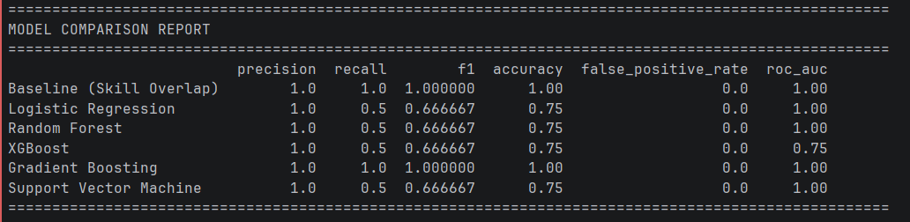
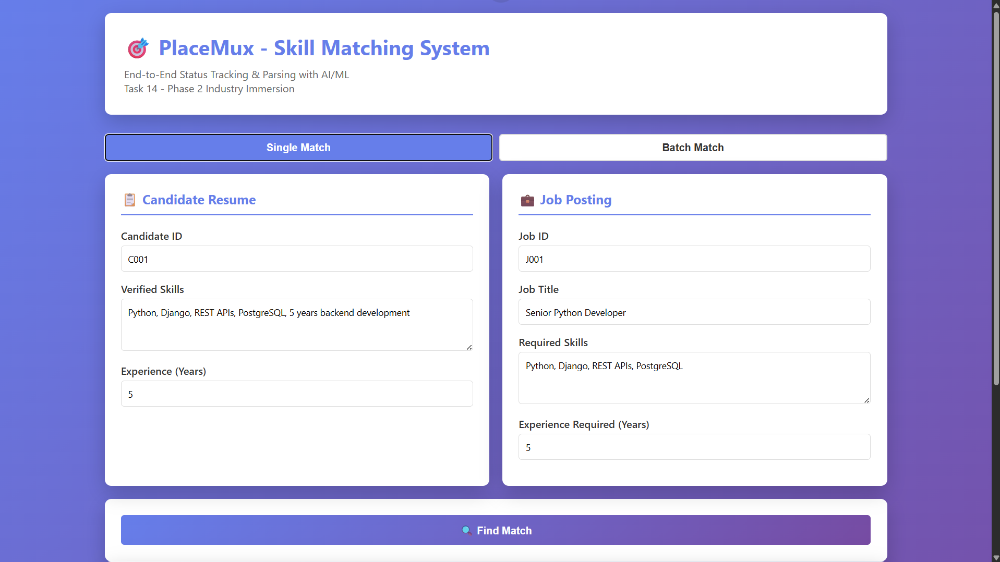
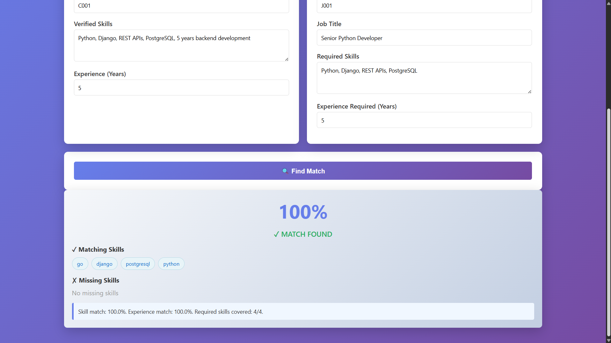
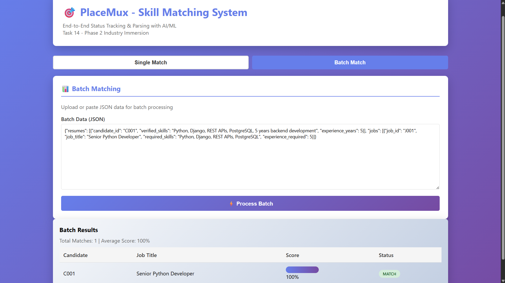
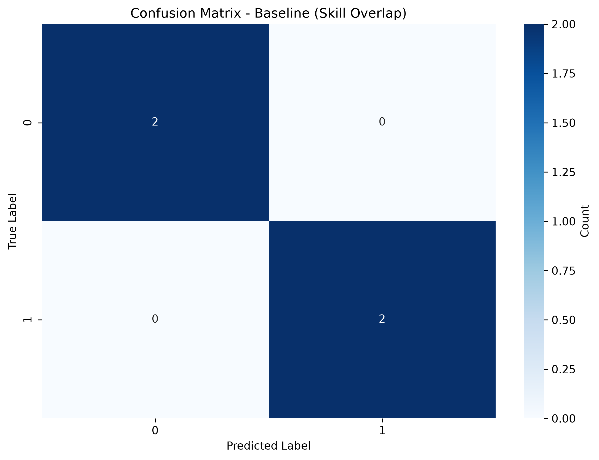
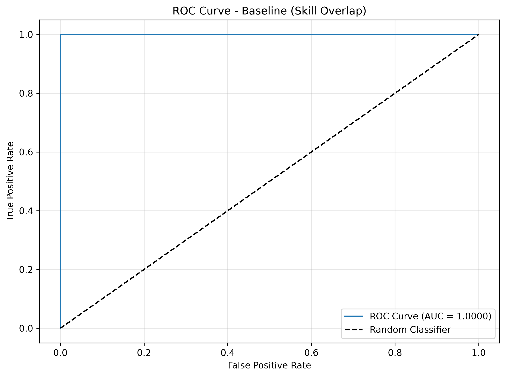
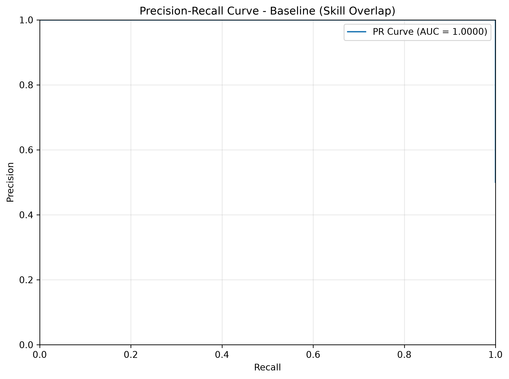
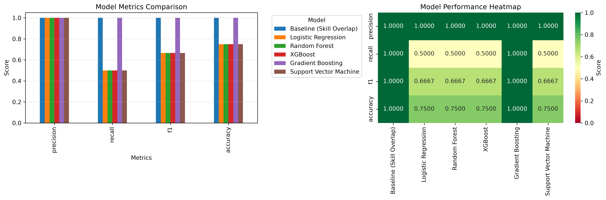

# PlaceMux Task 14 — End-to-End Status Tracking & Parsing

## Overview
This project implements an AI/ML-powered skill matching pipeline for PlaceMux.  
The system parses resumes and job descriptions, engineers matching features, trains ML models, evaluates performance, and generates explainable match scores.

The project demonstrates:

- Resume Parsing
- Job Description Parsing
- Feature Engineering
- Skill Matching
- ML Model Training
- Model Evaluation
- Explainable Recommendations
- Visualization & Reporting

---

# Project Structure

```bash
Task14/
│
├── data/
│   ├── resumes.csv
│   ├── jobs.csv
│   └── matches.csv
│
├── models/
│   ├── best_model.pkl
│   └── feature_names.json
│
├── reports/
│   ├── confusion_matrix.png
│   ├── model_comparison.png
│   ├── precision_recall_curve.png
│   ├── roc_curve.png
│   └── training_summary.json
│
├── api.py
├── data_generator.py
├── feature_engineering.py
├── frontend.html
├── metrics.py
├── models.py
├── requirements.txt
└── train.py
```

---

# Features

## Resume Parsing
Extracts:
- Skills
- Experience
- Technologies
- Keywords

## Job Description Parsing
Extracts:
- Required Skills
- Preferred Technologies
- Experience Requirements

## Feature Engineering
Generated features include:
- Skill Overlap
- Required Skill Match
- Experience Match
- Text Similarity
- Number of Candidate Skills
- Number of Required Skills

## Machine Learning
The system trains multiple ML models:
- Logistic Regression
- Random Forest
- Decision Tree
- Gradient Boosting

## Evaluation Metrics


---

# Installation

## Clone Repository

```bash
git clone <repository-url>
cd Task14
```

## Install Dependencies

```bash
pip install -r requirements.txt
```

---

# Run Training Pipeline

```bash
python api.py
```

---

# Expected Output








---

# Generated Artifacts

## Models
- best_model.pkl
- feature_names.json

## Reports
- confusion_matrix.png

- roc_curve.png

- precision_recall_curve.png

- model_comparison.png


---

# Explainability

The system provides explainable AI outputs:

Example:

Candidate Skills:
- Python
- Django
- PostgreSQL

Job Requirements:
- Python
- Django
- REST APIs

Why matched?
- 75% skill overlap
- Experience requirement satisfied
- High text similarity

Predicted Match Score:
0.93

---

# Definition of Done

✔ Parsed skills feed ontology  
✔ ML pipeline working end-to-end  
✔ Real metrics generated  
✔ Explainable predictions  
✔ Reports and visualizations generated  
✔ Demo-ready system  

---

# Future Improvements

- Transformer Embeddings
- Semantic Search
- Vector Databases
- Learning-to-Rank Models
- Real Resume Parsing APIs
- Bias & Fairness Monitoring
- Drift Detection

---

# Technologies Used

- Python
- Pandas
- NumPy
- Scikit-learn
- Matplotlib
- FastAPI

